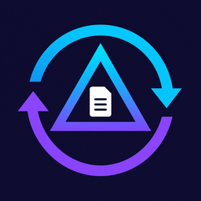
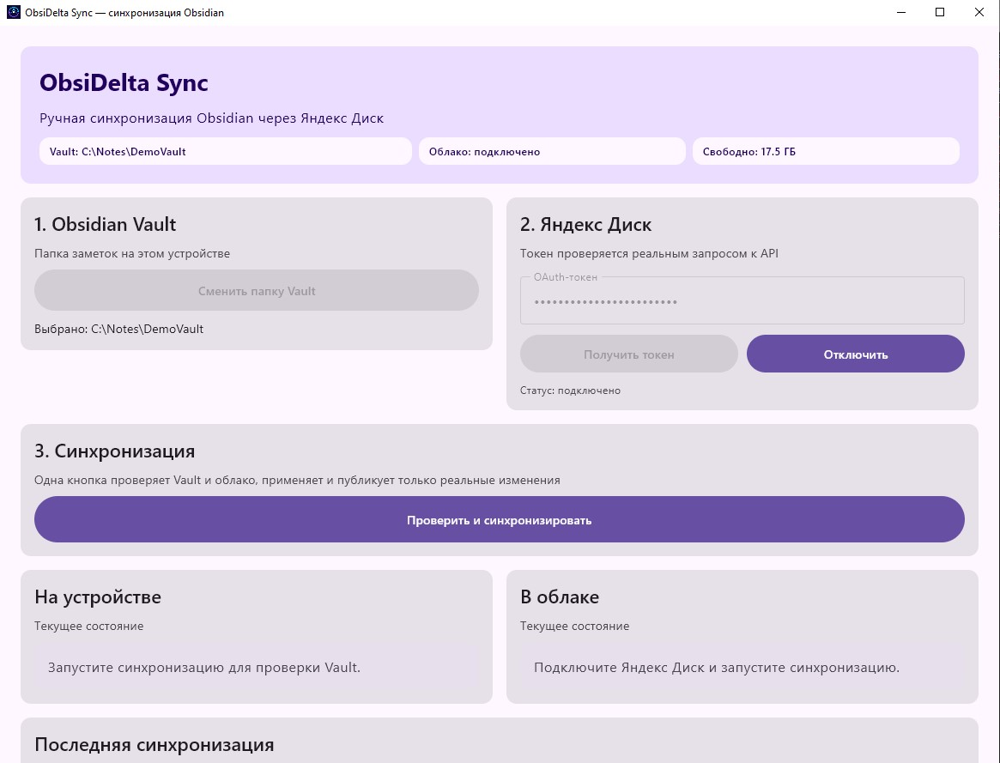
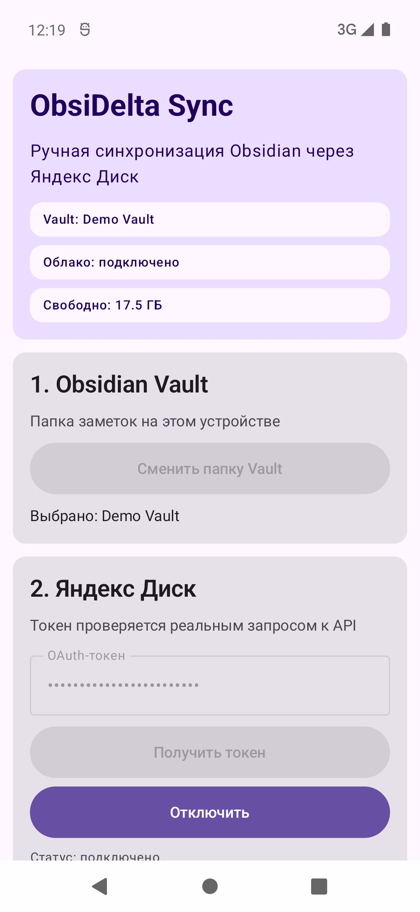

<p align="center">
  
</p>

<h1 align="center">ObsiDelta Sync</h1>

<p align="center">
  Клиент синхронизации Obsidian Vault через Яндекс Диск для Desktop и Android,<br>
  построенный на Kotlin Multiplatform и Compose Multiplatform.
</p>

<p align="center">
  
  
</p>

## Что решает приложение

ObsiDelta Sync сравнивает локальное и облачное состояние Vault по SHA-256, показывает найденные различия и переносит только реальные изменения. Повторный запуск без изменений не создаёт новый облачный пакет и не применяет файлы повторно.

- одна кнопка выполняет проверку Vault, проверку облака и синхронизацию;
- прогресс показывает текущий этап и обрабатываемый файл;
- новые, изменённые и удалённые файлы фиксируются в delta-пакетах;
- при конфликте показываются изменённые участки локальной и облачной версий;
- можно оставить облачную, вернуть локальную или сохранить обе рядом как отдельные синхронизируемые файлы;
- после 10 пакетов создаётся полный checkpoint, а старые пакеты удаляются;
- OAuth-токен хранится локально в зашифрованном виде и удаляется кнопкой «Отключить».

Автоматически синхронизируются текстовые форматы `.md`, `.txt`, `.json` и `.canvas`. Медиафайлы и бинарные файлы в текущей версии не отправляются.

## Состояние платформ

| Платформа | Состояние |
|---|---|
| Windows Desktop | Полная ручная синхронизация. Portable-сборка содержит собственный JVM runtime и не требует установленной Java. |
| Android | Полная ручная синхронизация через Android Storage Access Framework. |
| iOS | Общий Compose-интерфейс собирается, но платформенный шлюз к Vault и безопасному хранилищу токена ещё не реализован. Workflow публикует unsigned Simulator build, не IPA для App Store. |

## Как устроена синхронизация

1. Приложение сканирует поддерживаемые файлы и вычисляет SHA-256.
2. Из Яндекс Диска загружаются только ещё не применённые пакеты.
3. Перед заменой конфликтующего локального файла создаётся резервная копия и появляется карточка выбора версии.
4. «Оставить облачную» закрывает конфликт с текущим файлом; «Вернуть локальную» восстанавливает копию; «Сохранить обе рядом» создаёт `*.local-copy-<timestamp>.*`. Локальная версия сразу публикуется новым изменением.
5. После применения облака выполняется повторное сравнение снимков.
6. Новый пакет публикуется только при наличии изменений. При достижении лимита журнал сворачивается в один checkpoint.

Служебные файлы `.obsidelta`, Git, корзина Obsidian, временные файлы и device-specific workspace-файлы исключаются из снимка.

> Содержимое Vault хранится на Яндекс Диске без дополнительного end-to-end шифрования со стороны приложения. Шифруется только локально сохранённый OAuth-токен.

## Сборка

Требования: JDK 21, Android SDK; для iOS — macOS и Xcode.

```powershell
# тесты и проверки
.\gradlew.bat clean check

# Android APK и AAB
.\gradlew.bat :androidApp:assembleRelease :androidApp:bundleRelease

# portable Desktop с JVM рядом с exe
.\gradlew.bat :desktopApp:createDistributable

# native Desktop-пакеты текущей ОС
.\gradlew.bat :desktopApp:packageDistributionForCurrentOS
```

Portable Windows-приложение появляется в `desktopApp/build/compose/binaries/main/app/`. Для запуска на другом компьютере нужно переносить всю папку, а не только `.exe`.

### Локальная подпись Android

Скопируйте `secret.properties.example` в `secret.properties` или `.env.example` в `.env` и заполните четыре значения `ANDROID_*`. Оба локальных файла исключены из Git; переменные окружения имеют приоритет над файлами, затем используется `secret.properties`, затем `.env`.

Keystore и криптографически случайный пароль можно создать одной командой:

```powershell
.\scripts\Create-AndroidKeystore.ps1
```

По умолчанию keystore сохраняется в `$HOME/.android-keys/obsidelta-release.p12`, а настройки — в `secret.properties`. Скрипт откажется заменять существующий ключ или файл настроек. Отдельная генерация пароля:

```powershell
.\scripts\Create-AndroidKeystore.ps1 -GeneratePasswordOnly -PasswordLength 32
```

Путь к keystore может быть абсолютным или относительным от корня проекта. В Windows используйте прямые слеши, например:

```properties
ANDROID_KEYSTORE_PATH=C:/Users/your-name/.android-keys/obsidelta-release.p12
ANDROID_KEYSTORE_PASSWORD=your-password
ANDROID_KEY_ALIAS=obsidelta
ANDROID_KEY_PASSWORD=your-password
```

## Релизы

Workflow [`.github/workflows/release.yml`](.github/workflows/release.yml) запускается по тегу `v*` или вручную. Он собирает:

- Windows portable ZIP и native packages;
- подписанные Android APK и AAB;
- unsigned iOS Simulator ZIP;
- единый GitHub Release со всеми артефактами.

Для Android необходимо добавить в GitHub Actions Secrets:

- `ANDROID_KEYSTORE_BASE64` — JKS/PKCS12-файл в Base64;
- `ANDROID_KEYSTORE_PASSWORD`;
- `ANDROID_KEY_ALIAS`;
- `ANDROID_KEY_PASSWORD`.

Пример создания значения Base64 в PowerShell:

```powershell
[Convert]::ToBase64String([IO.File]::ReadAllBytes("release.jks"))
```

## Структура проекта

- `shared` — Compose UI, модели протокола, сравнение снимков, публикация и REST-клиент Яндекс Диска;
- `desktopApp` — файловая система Desktop, локальное безопасное хранилище и JVM packaging;
- `androidApp` — Storage Access Framework, Android Keystore и Android UI host;
- `iosApp` — iOS host для общего Compose-интерфейса.

Проект не связан с командами Obsidian или Яндекса и использует их продукты и API независимо.
